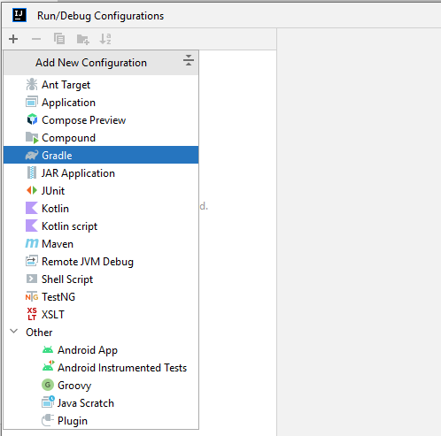
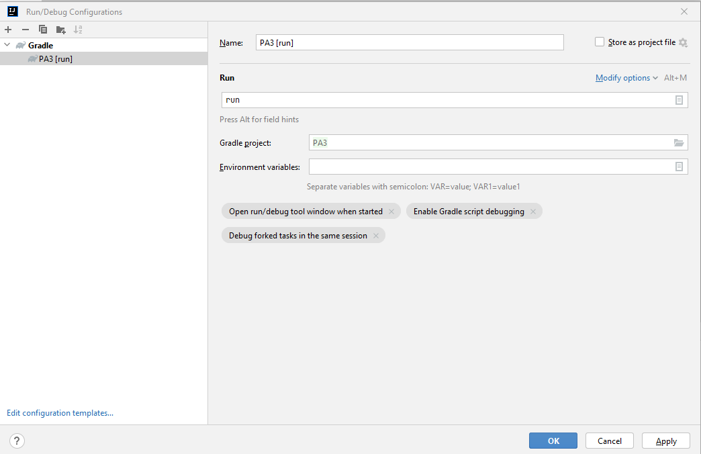

# COMP2026/COMP2046 Programming Assignment 3 - Discord bot

## 2023-24 Semester 1

* Designed by: [Dr. Kevin Wang](mailto:kevinw@comp.hkbu.edu.hk)
* Q & A: [Discord](https://discordapp.com/channels/1004554070083776672/1004554070083776678)
* Assignment Website: [GitHub](https://github.com/khwang0/COMP2045-2324PA3)
* Due: 
  * UAT Due: 23:59pm 20/11/2023 (Monday midnight)
  * Programming Due: 23:59pm 4/12/2023 (Monday midnight)
* Download the demo program: [here](demo.jar)
* Download everything from the assignment: [here](https://github.com/khwang0/COMP2045-2324PA3/archive/refs/heads/master.zip)
* Partnering rule: In this assignment, you are allowed to partner with another student to complete the coding part of the assignment with the following rules apply:
  * The student you have partnered must also be taking COMP2026/COMP2046 in this semester. 
  * Each student may partner with at most one other student.
  * Students who are in partner should work together physically at lab with our lab machines for most of the time. You need to report the date/time/location of your working session. We may audit that with our machine login time when necessary.
  * Maximum score of the assignment is 100. If you partner with another student, the maximum score will be **80**.
  * For students retaking this course, partnering with another student is highly encouraged and your maximum score will not be capped.
  * **UAT is an individual task**. You should not discuss with your partner about the UAT before the UAT due.
  * If you think you are one of the top students, simply ignore about this partnering rule.


> To run the demo program, type the following in your terminal:
> 
> ```sh
> java -jar demo.jar
> ```


# Learning outcome

Students are expected to have some practice on object-oriented concepts such as polymorphism, abstract class, and interface. We expect most students would spend ten hours finishing the assignment while perhaps more than 70% is trying to understand the assignment. Make sure you start as early as possible and ask us on Discord if you have any difficulty! 

Note: This time you are **allowed** to use advanced data structures such as List or ArrayList that we have covered in class. You are asked to add class attributes/fields and methods in this assignment except for the classes that have been written for you already:
- `bot/AbstractBot.java`
- `bot/CommandBot.java`
- `bot/TextBot.java`
- `tools/TextPair.java`

You are not suppose to modify the above classes.

# Introduction

Interestingly, we have been using Discord throughout the semester to communicate with each other. In this assignment we are going to implement a Discord bot that fits our course purposes. The bot will be able to do the following things:
1. **Ping Bot**: ping the bot and the bot will reply you with a message.
2. **Seat Checker**: the bot can help you check your quiz/practical test's seat number.
3. **UserManagement Bot**: with a given registration code, the bot can associate your Discord ID with your student ID.
4. **Who am I bot**: allow you to check if you have registered yet and what is your actual name.
5. **Score Bot**: the bot can help you check your in-class assessment scores.

You can test those function by interacting with the demo bot:
- type `ping`
- direct message (DM) the bot `seat`
- type `/registration <registration code>` to register yourself
- type `/whoami` to check your registration status
- type `/score` to check your score


## Explanation about the assignment

You are given the skeleton code. Complete all classes/methods in the assignment concerning the instructions stated in the Java file.

`MyFirstBot` is the main class of the program. It instantiates some bots and associates them to Discord via a third-party API (JDA). JDA is a very complicated API and therefore we have written some code for you to simplify the interface. In such a case, you don't need to read any documentation about JDA. However, if you are interested in how JDA works, you can read the documentation [here](https://ci.dv8tion.net/job/JDA/javadoc/).

In our project, there are two types of bots, `CommandBot` and `TextBot`. A `CommandBot` is to handle commands that start with `/` and a `TextBot` is to handle text messages. For example, if you type `/ping` in a channel, the `CommandBot` will handle the message and reply to you with a message. If you type `ping` in a channel, the `TextBot` will handle the message and reply to you with a message.


### CommandBot

A `CommandBot` is an abstract class that all its subclasses must implement the following methods:
- `protected abstract String respond(Command command)` To handle a command and return a message. 
- `protected abstract String getCommand();` To declare what command the bot is handling. For example, if the bot is handling `/whoami`, the method should return `whoami`.
- `protected abstract String getCommandHelp();` To explain what this command is about. For example, if the bot is handling `/whoami`, the method should return "tell the user who he is".

In `MyFirstBot` you will see a UserManagementBot, a ScoreBot, and a WhoAmIBot are created. You may want to comment some of them out if you are testing your code.

### TextBot

A `TextBot` is a final class that does not need to be inherited anymore. A `TextBot` keeps a list of MessageListener and it will call the `onMessageReceived` method of each listener when a message is received. You can add a listener to a `TextBot` by calling `addListener`. MessageListener is an interface that has only one method `onMessageReceived`. You can implement this method to handle the message received by the bot. For example, if you want to handle the message `ping`, you will need to implement that in the PingMessageListener class that implements the MessageListener interface. The method `onMessageReceived` should return a String that is the message you want to reply to the user.

### Message and Command

A `Message` is a class that represents a message sent by a user. A message simply contains the text (we don't consider messages in a format other than text, such as images/video/emoji etc..), the sender Discord ID, the sender Discord name, and if the message is sent in a private message (DM).

A `Command` is an extension of `Message` so that it also have _options_. Each option has two Strings - name and value. For example, in registration, you need to supply your registration code, for example, 123456. In this case, 
- name of the option: `regcode`
- value of the option: `123456`

Each `CommandBot` that needs a user to enter an option, will need to register the option name by calling the method `void addOption(String optionName, String optionDescription, boolean isRequired)`


## How to compile the program

First of all, you will need to have a Bot Account from Discord. It is suggested you follow the instructions [here](https://jda.wiki/using-jda/getting-started/) to setup a bot account. You will need to copy the **token** of your bot account (optionally paste it to the `MyFirstBot.java` > `token`).

Go to `MyFirstBot.java` and observe that the following code is enabled by default while the code below is disabled.
```java
//After getting started, delete the following lines and enable the code below
{
    jda.addEventListener(new MyListener());
    return;
} //getting started
```

We need to use a Java toolchain called `Gradle` to compile the program. In your intelliJ select from the toolbar `Run` > `Edit Configuration` and you will see the following screen.



Then select `Add New Configuration` and click the `+` button on the top left corner. Select `Gradle` and click `OK`. You should see the following screen.



Type `run` inside the `Tasks` field and click `OK`. You will find the run button enabled. Click the run button and you will be able to execute the code.

A successful run of the program may see the following output from your console. Then you can start interacting with the bot on Discord.

```txt
Please set the token in MyFirstBot.java, or enter here now
MTEzNDxxxxxxxxxxxxxxxxxx.GWeEXo.todiQJz-txxxxxxxxxxx-xxxxx-Z3spBGA
SLF4J: Failed to load class "org.slf4j.impl.StaticLoggerBinder".
SLF4J: Defaulting to no-operation (NOP) logger implementation
SLF4J: See http://www.slf4j.org/codes.html#StaticLoggerBinder for further details.
SLF4J: Failed to load class "org.slf4j.impl.StaticMDCBinder".
SLF4J: Defaulting to no-operation MDCAdapter implementation.
SLF4J: See http://www.slf4j.org/codes.html#no_static_mdc_binder for further details.
[main] INFO JDA - Login Successful!
[JDA MainWS-ReadThread] INFO WebSocketClient - Connected to WebSocket
[JDA MainWS-ReadThread] INFO JDA - Finished Loading!
Print Log: TextBot is running.
Registration bot:
There are 1/3 users has registered the system
Print Log: TextBot is running.
Registration bot:
There are 1/3 users has registered the system
Print Log: TextBot is running.
Registration bot:
```

> The reason that we are using Gradle here is because there is an extra library JDA that we need to use in order to link with your Discord.


## `TestClass` class

There is no TestClass to be provided in this assignment. You are supposed to work it on your own now.

# Understanding the Assignment Test (UAT)

This part is independent of your programming code. You will need to answer the following short questions by **another due date**.
Submit your answers on Moodle. 

1. Would the reply message be different if he/she DM `ping` to the bot or type `ping` in a channel?
2. Would the reply message be different if he/she DM `seat` to the bot or type `seat` in a channel?
3. Can a user register twice?
4. Can a user register with a wrong registration code?
5. Which class is the superclass of `CommandBot`?

---


# Submission 
For submission: zip your `src` folder and upload the zip file to Moodle.

Please be reminded that both the **Late Penalty Rule** and the **Penalty for Plagiarism** are applied strictly to all submissions of this course (including this assignment).   

### Late Penalty Rule

```java
if (lateHour > 0) {
    if (lateHour < 24) 
        mark *= 0.8;
    else if (lateHour < 48)
        mark = mark >> 1;
        else if (lateHour < 72)
            mark = mark >> 2;
            else
                mark &= 0;
}
```


 ## Plagiarism

 Plagiarism is a serious offense and can be easily detected. Please don't share your code to your classmate even if they are threatening you with your friendship. If they don't have the ability to work on something that can compile, they would not be able to change your code to a state that we can't detect the act of plagiarism. For the first commit of plagiarism, regardless you shared your code or copied code from others, you will receive 0 with an addition of 5-mark penalty. If you commit plagiarism twice, your case will be presented in the exam board and you will receive a F directly.


> # Terms about generative AI
> You are not allowed to use any generative AI in this assignment.
> The reason is straight forward. If you use generative AI, you are
> unable to practice your coding skills. We would like you to get
> familiar with the syntax and the logic of the Java programming.
> We will examine your code using detection software as well as 
> inspecting your code with our eyes. Using generative AI tool 
> may fail your assignment.

## Marking Scheme 
This assignment is worth X% of the course mark.  There are three elements in the marking scheme: 
* 5% - Understanding the Assignment Test (UAT)
* 30% - the program can be compiled without any error
* 65% - a working program that functions as specified 
* 10% - Extra marks for implementing some extra features. If you attempt to implement some extra features, please state it clearly in a separated document.

 

## Interview 
Should the teaching team see fit, students may be requested to attend an interview to explain about their program.  Students failing to attend such interview or to demonstrate a good understanding of their own program may result in mark deduction. 


